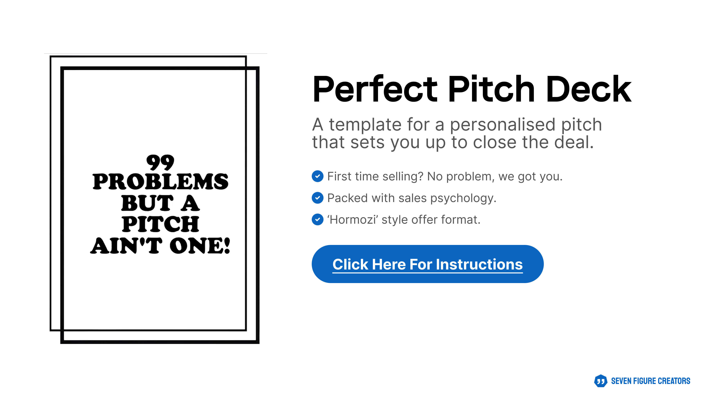
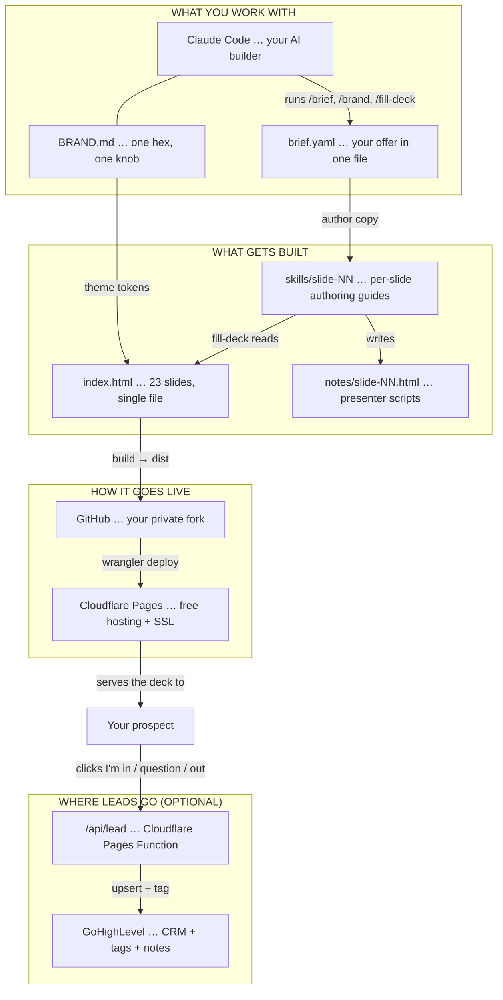

<p align="center">
  
</p>

# Perfect Pitch Deck Kit

Pitch decks that close, without you ever touching Figma.

**Live demo →** [perfect-pitch-deck.pages.dev](https://perfect-pitch-deck.pages.dev)

---

## WHY THIS EXISTS

I spent ten years in Figma. Pushing pixels around. Like a chump.

Then Claude Code happened.

The Figma version of this kit helped people close real deals. First deals. Bigger deals. More deals. I'm proud of that.

But every user hit the same wall… Figma is hard if you're not a designer. Even with templates.

So I killed the Figma kit and resurrected it in code. Same proven structure. New shell. No Figma. No CSS to wrestle with.

You paste your offer into a brief. You hit `/fill-deck`. You ship a branded 23-slide pitch to a live URL.

I built a full deck with it in 15 minutes. So can you.

---

## WHAT'S IN THE BOX

→ 23 strategically sequenced slides with sales psychology baked in
→ One-knob rebranding from a pasted hex (or "make it Stripe blue")
→ Brief-driven copy authoring with hard character budgets so nothing breaks the layout
→ Speaker notes that ONLY show on your screen when you present (optionally passphrase-protected)
→ Final CTA slide that syncs leads to GoHighLevel… or a static "book a call" button if you'd rather skip the form
→ Optional passphrase gate on the whole deck
→ One command to ship the whole thing to a live Cloudflare Pages URL

---

## HOW IT ALL FITS TOGETHER

Never touched code before? No worries. Here's every piece and how they connect.



---

## ZERO TO LIVE IN AN HOUR (OR LESS)

What you need: Node 20+, [Claude Code](https://claude.com/claude-code), [GitHub CLI](https://cli.github.com), and [Wrangler](https://developers.cloudflare.com/workers/wrangler/) (`brew install gh && npm install -g wrangler`).

```bash
# 1. Fork + clone (30s)
gh auth login
gh repo fork stvbutlr/perfect-pitch-deck --clone && cd perfect-pitch-deck
npm install
npm run dev                  # http://localhost:8765 — the demo deck

# 2. Open Claude Code in your terminal
claude

# Then, inside Claude Code:
> /brand                     # paste your hex, screenshot, Figma URL, or "make it Stripe"
> /brief                     # paste a paragraph about your offer
> /fill-deck                 # authors copy for all 23 slides + speaker notes
> /check                     # validates brand tokens and slot budgets

# 3. (Optional) wire the slide-23 form to GoHighLevel
> /ghl-setup                 # API token + Location ID + .env + smoke test

# 4. Ship it
> /deploy                    # wrangler login, project create, build, deploy
                             # prints https://<your-project>.pages.dev
```

Done. Send the URL.

---

## THE SLASH COMMANDS

| Command | What it does |
| --- | --- |
| `/brand` | Rebrand from any input. Hex code. Screenshot. Figma URL. Plain English. Pasted SVGs. Themifies your logo to `currentColor`, runs a contrast check on white-on-accent. |
| `/brief` | Builds `brief.yaml` from any input. Paragraph dump. Screenshots. Notion paste. Partial YAML. Voice memo. Echoes a readable summary for verification. |
| `/fill-deck` | Authors copy for all 23 slides. Resumable via `_qa/fill-deck-report.md`. Hard char limits so copy never breaks the layout. |
| `/fill-slide N — <hint>` | Re-author one slide. Shows before/after diff. Waits for confirmation. |
| `/ghl-setup` | Wires slide 23's form to your GoHighLevel account. Optional. Skip for static-CTA mode. |
| `/deploy` | Ships to Cloudflare Pages. First run creates the project. Later runs update it. |
| `/check` | Runs the validators and prints a combined report with fix suggestions. |

---

## HOW TO BRIEF CLAUDE (THE IDEAL ONE-SHOT)

The kit will run on rough input. It runs better on this:

→ Your **company name** plus a short memorable **pitch name** ("The 30-Day Sprint")
→ Who you're pitching to (first name helps)
→ Your **offer**… name, dream outcome, timeframe, price
→ The **biggest problem** your customer has right now, in their words
→ Your **unique mechanism**… the "because" that makes the promise believable
→ Your **guarantee** or risk-reversal
→ **1-3 customer testimonials**… quote, name, metric
→ Up to **12 customer logos** you've worked with
→ Where you want them to click next (URL plus button label)
→ Optional: bonuses, urgency, pricing tiers, team

`brief.example.yaml` shows what this looks like in a finished file. `brief.yaml.template` is a blank version with field-by-field comments.

---

## CUSTOMISING

| What you want to change | Where | How |
| --- | --- | --- |
| Brand accent colour | `:root --accent` in `index.html` | `/brand` |
| Logo / wordmark | `assets/brand/{mark,wordmark}.svg` | `/brand` (themifies SVGs to `currentColor`) |
| Fonts | `--font-display` / `--font-body` plus Google Fonts `<link>` | `/brand` |
| Per-slide copy | The Nth `<section>` plus `notes/slide-NN.html` | `/fill-deck` or `/fill-slide N` |
| Strategic notes | `notes/slide-NN.html` | hand-edit, then `node scripts/inject-notes.mjs` |
| Slot char budgets | `slides/schema.json` | hand-edit OR `node scripts/calibrate-slots.mjs` to remeasure |
| GHL integration | `functions/api/lead.js` plus `.env` | `/ghl-setup` |

`CLAUDE.md` at the repo root tells Claude exactly what's safe to touch and what's locked. Read it once.

---

## REPO ANATOMY

```
perfect-pitch-deck/
├─ index.html                  the deck (single-file Reveal.js, 23 sections)
├─ brief.yaml                  your offer (written by /brief)
├─ brief.example.yaml          the demo brief
├─ brief.yaml.template         blank template with comments
├─ deck.config.json            site name, allowed origins, CF project
├─ BRAND.md                    token catalogue plus allowed contrast pairs
├─ CLAUDE.md                   guardrails for Claude
├─ .env.example                secrets template
│
├─ .claude/commands/           the 7 slash commands
├─ skills/
│   ├─ fill-deck/SKILL.md      orchestration (1 → 23)
│   ├─ fill-slide/SKILL.md     single-slide retry
│   └─ slide-NN-<slug>/        per-slide authoring guide (× 23)
├─ notes/slide-NN.html         full strategic reference per slide (× 23)
├─ slides/
│   ├─ manifest.json           slide index → slug → archetype
│   └─ schema.json             per-slot specs (selector, max chars, fragility)
├─ assets/
│   ├─ brand/                  mark, wordmark, og-image, favicon
│   └─ speaker-view.html       self-hosted speaker view (survives refresh)
├─ functions/api/lead.js       Cloudflare Pages Function (GHL upsert)
├─ scripts/
│   ├─ build.mjs               validate plus assemble dist
│   ├─ build-skills.mjs        regenerate skill files from schema plus notes
│   ├─ inject-notes.mjs        splice notes into the deck
│   ├─ validate-brand.mjs      token-leak plus asset-manifest check
│   ├─ validate-deck.mjs       slot completeness plus char-budget check
│   ├─ calibrate-slots.mjs     binary-search per-slot maxChars in real DOM
│   ├─ ghl-ping.mjs            smoke-test GHL credentials
│   ├─ qa-screenshots.mjs      puppeteer thumbnails of every slide
│   └─ reorder-sections.mjs    reshuffle <section> blocks if you reorder
└─ staticrypt-template.html    passphrase gate page (when DECK_PASSWORD set)
```

---

## BUILD AND DEPLOY MODES

`scripts/build.mjs` reads env vars:

| Env var | Effect |
| --- | --- |
| `DECK_PASSWORD=<pp>` | Staticrypt the whole deck. Viewers see a passphrase prompt first. |
| `DECK_REMEMBER_DAYS=N` | How many days staticrypt remembers the unlock (default 30). `0` to force every visit. |
| `NOTES_PASSWORD=<pp>` | AES-encrypt the speaker notes. Pressing `S` then prompts for the notes passphrase. Independent of `DECK_PASSWORD`. |
| `INCLUDE_NOTES=false` | Strip speaker notes from `dist/` entirely. Use for public marketing decks. |
| `CF_PROJECT=<name>` | Cloudflare Pages project name for `npm run deploy`. |

Examples:

```bash
# Public deck, no gate, notes ship inline
npm run ship

# Public deck, speaker notes encrypted separately
NOTES_PASSWORD='presenter-only' npm run ship

# Gated deck plus encrypted notes (two different passphrases)
DECK_PASSWORD='deck-pass' NOTES_PASSWORD='notes-pass' npm run ship
```

---

## KEYBOARD SHORTCUTS

→ `→` / `←`… navigate
→ `Esc`… overview
→ `F`… fullscreen
→ `S`… open speaker notes (prompts for passphrase if `NOTES_PASSWORD` is set)

---

## SPEAKER NOTES

Every slide ships with presenter notes in `notes/slide-NN.html`. Press `S` while presenting to open the speaker window… current slide, next slide, notes, timer. The window has a real URL (`/assets/speaker-view.html`) so refreshing it works.

When `NOTES_PASSWORD` is set, the speaker-notes button in the HUD shows a 🔒. Click or press `S`, enter the passphrase, notes decrypt in your browser, speaker view opens. The unlock is cached locally for 30 days. To test the locked flow again, clear `localStorage` for the deck domain.

---

## CREDIT

This kit is the successor to my [Perfect Pitch Deck Figma template](https://www.figma.com/community/file/1430528713594279249). Same slide structure. Same sales psychology. New shell.

If Figma is your thing, the original is still up. If code-shipped landing-page energy is your thing… you're in the right repo.

---

## LICENSE

See `LICENSE`. Short version: use it for your own business or client work, modify it however you want, don't resell it as a template.

– Steve
